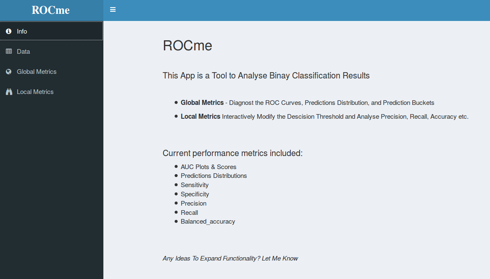
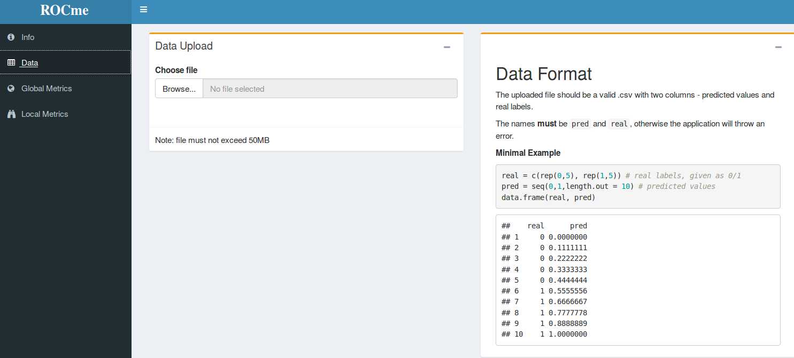
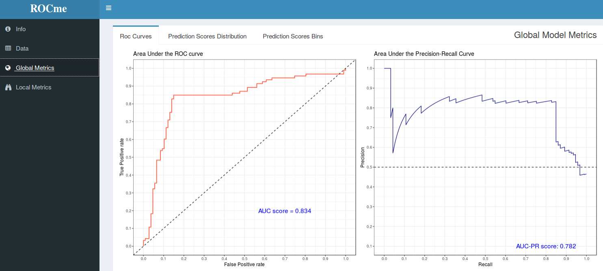
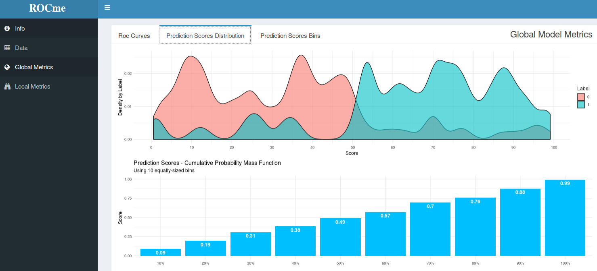
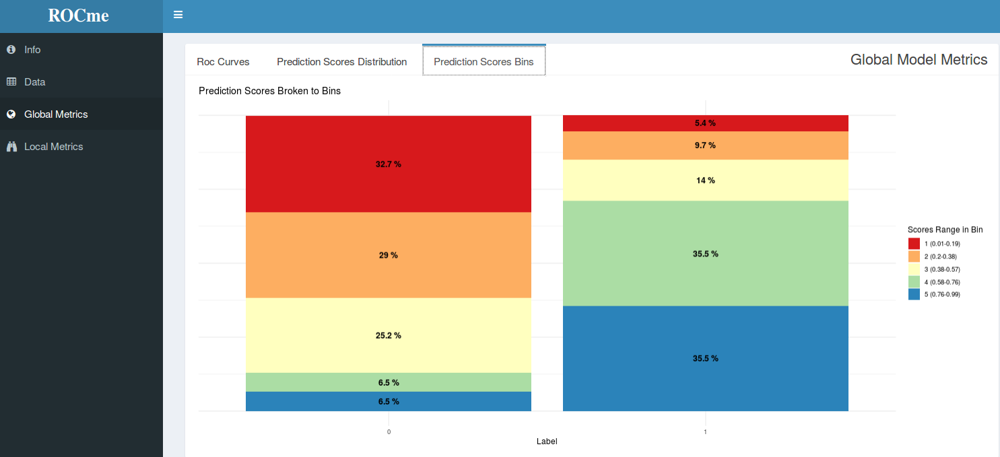
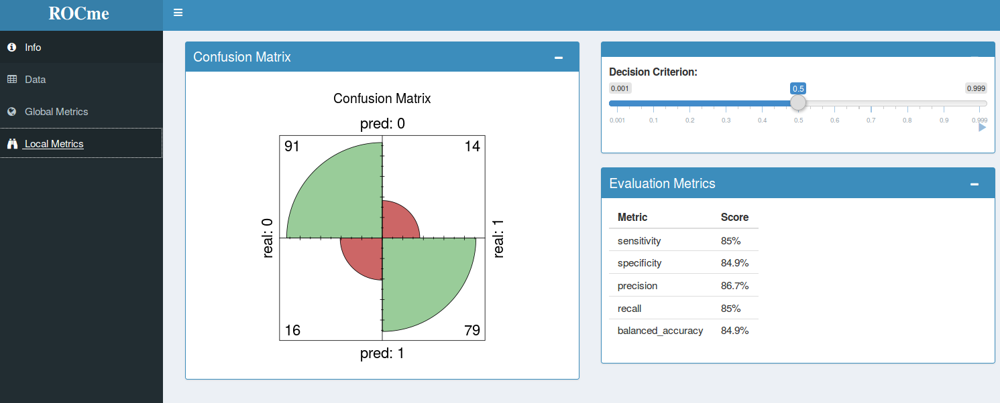

```{r setup, include=FALSE}
knitr::opts_chunk$set(echo = TRUE)
```

<br>

## Analyze Binary Classifiers

<br>

### Version 1.0.0

<br>

+ **Global Metrics** - Diagnose the ROC Curves, Predictions Distribution, and Prediction Buckets

+ **Local Metrics** Interactively Modify the Decision Threshold and Analyse Precision, Recall, Accuracy etc.


<br><br>

#### Current performance metrics included:

  * AUC Plots & Scores  
  * Predictions Distributions  
  * Sensitivity
  * Specificity
  * Precision
  * Recall
  * Balanced_accuracy

<br>


## Functionalities


### Info Tab:

Basic Information about the Application:

<br>

<br><br>


### Upload Tab:

Upload a .csv file in the expected format, as detailed in the `info` tab:

<br>

<br><br>


### Global Metrics:

Metrics to evaluate the overall performance of the Model:

<br>

<br>

<br>

<br>

<br>

<br><br>

### Local Metrics:

Interact with the Decision Threshold to inspect Local Performance Metrics:

<br>

<br><br>

